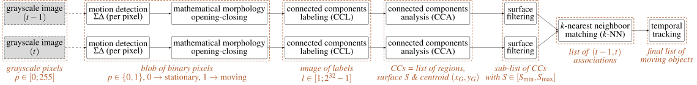

# Motion

This project is a simple image processing chain that detects motion between two
consecutive frames. Then, the moving objects are tracked over time.
Two strong assumptions are made:
  1. the camera is fixed (not moving),
  2. the light intensity is constant over time.



## Dependencies

This project uses `ffmpeg-io`, `nrc2`, `c-vector` and `mipp` projects as 
Git submodules, **you need to download them with the following command**:
```bash
git submodule update --init --recursive
```

Note that `ffmpeg-io` requires the `ffmpeg` executable: **you need to install 
`ffmpeg` on your system** if you want to be able to read/write video files.
In addition, if you want to enable text indications in generated videos/images, 
the `OpenCV` library is required.

Moreover this project uses `cmake` in order to generate a Makefile.

On Debian like systems you can easily install these packages with the `apt` 
package manager:
```bash
sudo apt install ffmpeg libopencv-dev cmake
```

## Compilation

To compile an optimized version of the code with debug info and link with 
`OpenCV` and `mipp` libraries:
```bash
mkdir build
cd build
cmake .. -DMOTION_OPENCV_LINK=ON -DMOTION_USE_MIPP=ON -DCMAKE_BUILD_TYPE=RelWithDebInfo -DCMAKE_CXX_FLAGS_RELWITHDEBINFO="-O3 -g" -DCMAKE_C_FLAGS_RELWITHDEBINFO="-O3 -g" -DCMAKE_CXX_FLAGS="-Wall -funroll-loops -fstrict-aliasing -march=native" -DCMAKE_C_FLAGS="-funroll-loops -fstrict-aliasing -march=native"
make -j4
```

This will produce the `motion2` executable binary file in the `build` folder.

## Command Line Interface (CLI)

Here is the output of `./bin/motion2 -h` (default values are specified between 
`[VAL]`, no default value means that the parameter is a boolean):
```
--vid-in-path     Path to video file or to an images sequence                            [NULL]
--vid-in-start    Start frame id (included) in the video                                 [0]
--vid-in-stop     Stop frame id (included) in the video (if set to 0, read entire video) [0]
--vid-in-skip     Number of frames to skip                                               [0]
--vid-in-buff     Bufferize all the video in global memory before executing the chain        
--vid-in-loop     Number of times the video is read in loop                              [1]
--vid-in-threads  Select the number of threads to use to decode video input (in ffmpeg)  [0]
--vid-in-dec-hw   Select video decoder hardware acceleration ('NONE', 'NVDEC', 'VIDTB')  [NONE]
--sd-n            Value of the N parameter in the Sigma-Delta algorithm                  [2]
--ccl-fra-path    Path of the files for CC debug frames                                  [NULL]
--ccl-fra-id      Show the RoI/CC ids on the ouptut CC frames                                
--cca-roi-max1    Maximum number of RoIs after CCA                                       [65536]
--cca-roi-max2    Maximum number of RoIs after surface filtering                         [8192]
--flt-s-min       Minimum surface of the CCs in pixels                                   [50]
--flt-s-max       Maxumum surface of the CCs in pixels                                   [100000]
--knn-k           Maximum number of neighbors considered in k-NN algorithm               [3]
--knn-d           Maximum distance in pixels between two images (in k-NN)                [10]
--knn-s           Minimum surface ratio to match two CCs in k-NN                         [0.125000]
--trk-ext-d       Search radius in pixels for CC extrapolation (piece-wise tracking)     [5]
--trk-ext-o       Maximum number of frames to extrapolate (linear) for lost objects      [3]
--trk-obj-min     Minimum number of frames required to track an object                   [2]
--trk-roi-path    Path to the file containing the RoI ids for each track                 [NULL]
--log-path        Path of the output statistics, only required for debugging purpose     [NULL]
--vid-out-path    Path to video file or to an images sequence to write the output        [NULL]
--vid-out-play    Show the output video in a SDL window                                      
--vid-out-id      Draw the track ids on the ouptut video                                     
--stats           Show the average latency of each task                                      
--help, -h        This help                                            
```

## Examples of Use

### Standard Definition (320x240 pixels, SD)

Download and unzip a video sequence:
```bash
wget www-soc.lip6.fr/~lacas/ImageProcessing/MotionDetection/car3.zip
unzip car3.zip
```

Run `motion2` on it:
```bash
mkdir cars_ccl # this is required for the '--ccl-fra-path' option
./bin/motion2 --vid-in-path ./car3/car_3%03d.pgm --ccl-fra-path ./cars_ccl/%03d.png --log-path ./log_cars --vid-out-play --vid-out-id
```

### Full High Definition (1920x1080 pixels, Full HD)

Download and unzip a pack of video sequences:
```bash
wget www.potionmagic.eu/~adrien/data/traffic.zip
unzip traffic.zip
```

Run `motion2` on it:
```bash
mkdir traffic_1080p_ccl # this is required for the '--ccl-fra-path' option
./bin/motion2 --vid-in-path ./traffic/1080p_day_street_side_view.mp4     --ccl-fra-path ./traffic_1080p_ccl/%03d.png --flt-s-min 2000 --knn-d 50 --trk-obj-min  5 --log-path ./log_traffic_1080p --vid-out-play --vid-out-id
./bin/motion2 --vid-in-path ./traffic/1080p_day_street_top_view_snow.mp4 --ccl-fra-path ./traffic_1080p_ccl/%03d.png --flt-s-min 2000 --knn-d 50 --trk-obj-min  5 --log-path ./log_traffic_1080p --vid-out-play --vid-out-id
./bin/motion2 --vid-in-path ./traffic/1080p_day_street_top_view.mp4      --ccl-fra-path ./traffic_1080p_ccl/%03d.png --flt-s-min  150 --knn-d 50 --trk-obj-min 25 --log-path ./log_traffic_1080p --vid-out-play --vid-out-id
```

### Ultra High Definition (3840x2160 pixels, 4K)

Download and unzip a pack of video sequences (note that this is the same file as 
for Full HD ;-), you don't need to download it twice):
```bash
wget www.potionmagic.eu/~adrien/data/traffic.zip
unzip traffic.zip
```

Run `motion2` on it:
```bash
mkdir traffic_2160p_ccl # this is required for the '--ccl-fra-path' option
./bin/motion2 --vid-in-path ./traffic/2160p_day_highway_car_tolls.mp4 --ccl-fra-path ./traffic_2160p_ccl/%03d.png --flt-s-min 500 --knn-d 50 --trk-obj-min 50 --log-path ./log_traffic_2160p --vid-out-play --vid-out-id
./bin/motion2 --vid-in-path ./traffic/2160p_night_street_top_view.mp4 --ccl-fra-path ./traffic_2160p_ccl/%03d.png --flt-s-min 500 --knn-d 50 --trk-obj-min  5 --log-path ./log_traffic_2160p --vid-out-play --vid-out-id
```
